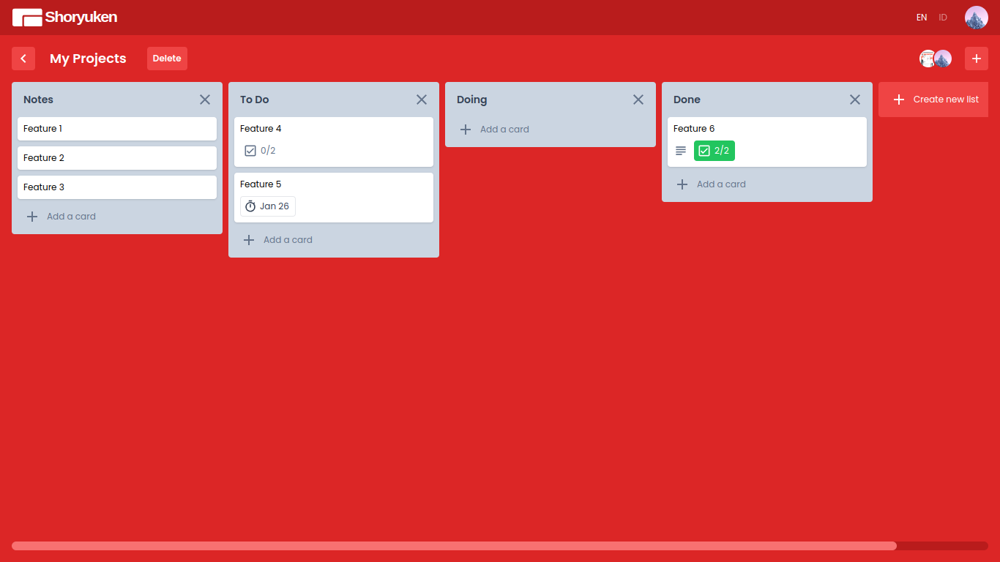
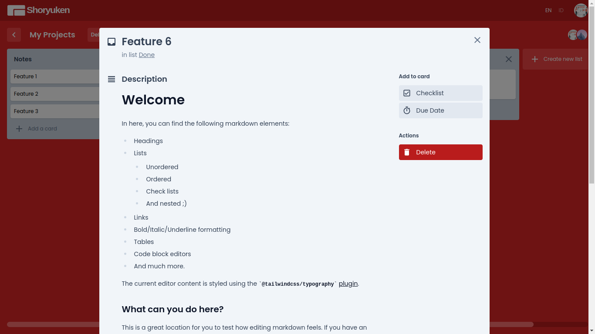
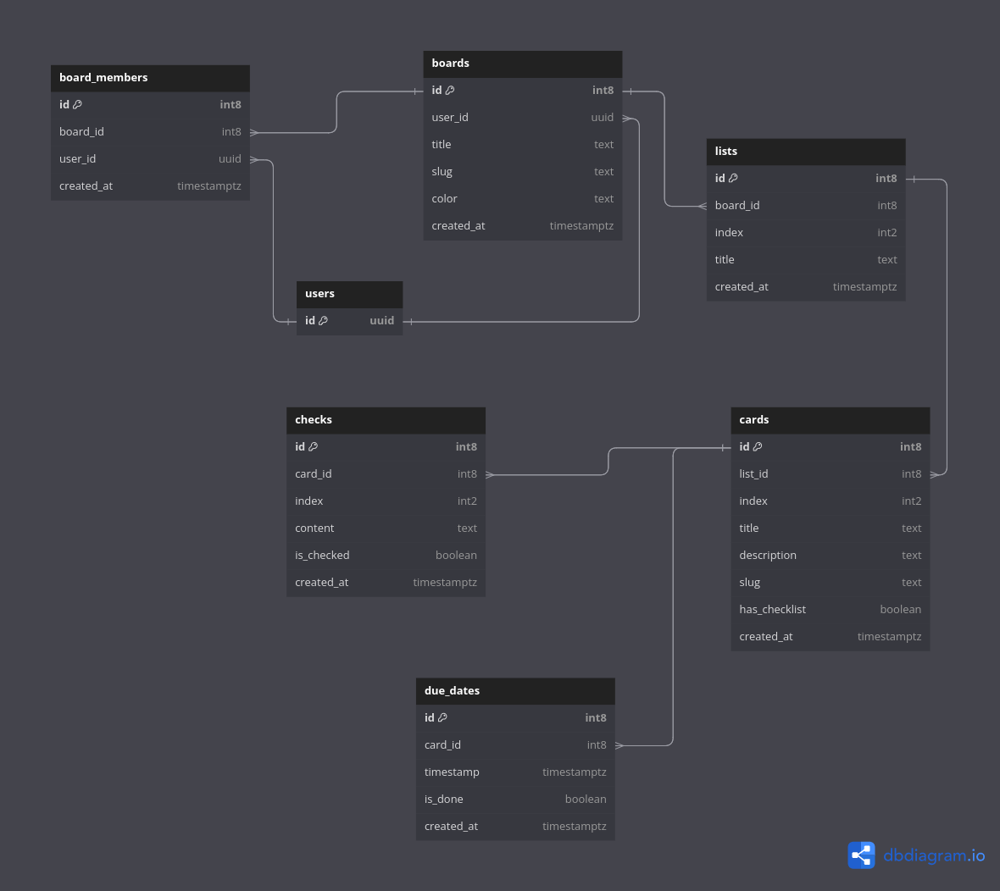

# Shoryuken

Shoryuken is Trello-like web app created with NextJS and TailwindCSS.



It has some features like:
- Authentication.
- Update user profile.
- Create a board, open board detail, update board title, and delete a board.
- Create a list, update list content, move a list and delete a list.
- Create a card, update card content, move a card, and delete a card.



## Prerequisites

You need to install these first on your machine:
- NodeJS v18.17.* as minimum
- Yarn 1.22.21
- Git
- VSCode

## Installation

You need to follow these steps to run this project on your machine:

1. Clone the repo from GitHub.

```bash
git clone git@github.com:gattigaga/shoryuken.git
```

2. Open the directory and run `yarn` to install `node_modules`.

```bash
yarn
```

3. Sign in and create a project in [Supabase](https://supabase.com/).

4. Create database with this schema below in Supabase [here](https://app.supabase.com/project/YOUR_PROJECT_ID/editor).



5. Create a view from auth.users in SQL Editor in Supabase [here](https://supabase.com/dashboard/project/YOUR_PROJECT_ID/sql/new).

```sql
create or replace view public.users as select id, email, raw_user_meta_data from auth.users;
revoke all on public.users from anon, authenticated;

grant select on users to anon;
grant select on users to authenticated;
```

6. Setup to enable Google Authentication in Supabase with this [guide](https://supabase.com/docs/guides/auth/auth-google).

7. Create `.env.local` in root directory and fill it with supabase url and anon key you got from this [page](https://app.supabase.io/project/YOUR_PROJECT_ID/settings/api) in Supabase.

```bash
NEXT_PUBLIC_SUPABASE_URL=
NEXT_PUBLIC_SUPABASE_ANON_KEY=
```

8. Run the project with `yarn`.

```bash
yarn dev
```

## Motivation

I create Shoryuken because I seek for a new frontend challenges and I think Trello is a good example. It has many interactivity features like drag and drop card, create a board, and etc.
